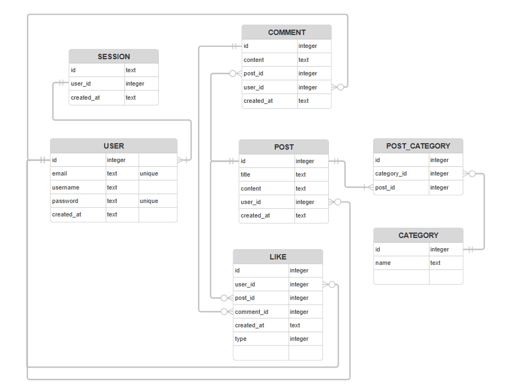

# Forum

This is a web-based forum that allows users to communicate, post content, and interact with each other's posts and comments. <br>
The forum is built using Go and SQLite, with user authentication, likes/dislikes, and filtering features. <br>
The application is containerized using Docker for easier deployment.<br>

### Project structure

```
forum/
├── main.go                    # Entry point of the application
├── go.mod                     # Go module definition
├── go.sum                     # Dependency checksums
├── ERD.png                    # Entity-Relationship Diagram for database schema
├── Dockerfile                 # Configuration for Docker containerization
├── docker.sh                  # Shell script to build and run Docker container
├── .gitignore                 # Files and directories to ignore in Git
├── .dockerignore              # Files and directories to exclude from Docker build
├── README.md                  # Project documentation
├── database/
│   ├── database.go            # Handles database connection setup
│   ├── queries.go             # Contains reusable database query logic
│   └── table.go               # Includes table creation or schema management logic
├── templates/
│   ├── addons.html            # Shared HTML components
│   ├── create-post.html       # Template for creating a post
│   ├── error.html             # Template for error pages
│   ├── index.html             # Home page template
│   ├── login.html             # Template for user login
│   ├── post.html              # Template for viewing posts and comments
│   └── signup.html            # Template for user signup
├── assets/
│   ├── favicon.ico            # Favicon for the application
│   └── styles.css             # CSS file for frontend styling
├── web/
    ├── createpost.go          # Handles logic for creating posts
    ├── dbquery.go             # Reusable queries for database operations
    ├── home.go                # Home page logic
    ├── login.go               # Handles user login
    ├── logout.go              # Handles user logout
    ├── pagehandler.go         # Template rendering and error handling
    ├── postpage.go            # Handles post viewing and commenting
    ├── signup.go              # Handles user registration
    └── structs.go             # Shared data structures
```

### Running with Docker

1. **Give user rights to the shell script**:
   ```bash
   chmod +x docker.sh
   ```
2. **Run the Docker script:**
   ```bash
       ./docker.sh
   ```
3. **Access the forum:**
   Once the container is up, open it in Docker and visit the forum in your browser.

### Running without Docker (Go only)

**If you prefer to run the project directly with Go**:

1. go run .

2. Access the forum: Open your browser and go to http://localhost:8080

### ER Diagram



### Authentication

Once the user logs in, they are given a UUID token in a session cookie. This token is used to authenticate the user.<br>
The token is stored in the database and is used to authenticate the user. When an user logs out, the token is deleted from the database.<br>
When a user is registering, we store is username and hashed password with bcrypt in the database.

## Features

- **User Registration & Authentication**:

  - Users can register by providing their email, username, and password.
  - Passwords are encrypted.
  - Only registered users can create posts and comments.
  - Sessions are managed using cookies.

- **Posts & Comments**:

  - Registered users can create posts and associate them with categories.
  - Users can also comment on posts.
  - Posts and comments are visible to all users (registered or not).

- **Likes/Dislikes**:

  - Registered users can like or dislike posts and comments.
  - The number of likes and dislikes is visible to everyone.

- **Filtering**:

  - Registered users can filter posts by:
    - Categories
    - Posts created by them
    - Posts they've liked

- **SQLite Database**:

  - Data such as users, posts, comments, and likes/dislikes are stored in an SQLite database.
  - At least one SELECT, CREATE, and INSERT SQL query is used.

- **Docker**:
  - The forum application is containerized using Docker for easy deployment and scalability.

## Setup & Installation

### Prerequisites

- Docker (for containerization)
- Go (for the backend)
- SQLite (for database)

### Steps to Run Locally

1. **Clone the repository**:
   ```bash
   git clone https://01.gritlab.ax/git/rhongist/forum.git
   cd forum
   ```

### Technologies Used

**Go:** Backend server and logic.<br>
**SQLite:** Local database for storing users, posts, comments, likes/dislikes.<br>
**Docker:** Containerization of the app for easy deployment.<br>
**Cookies & Sessions:** For user authentication and maintaining logged-in sessions.<br>
**HTML:** Basic frontend to display forum posts and comments.<br>

### Database Structure

The SQLite database contains tables for users, posts, comments, and likes/dislikes.<br>
The relationships between these entities are defined through SQL queries, ensuring proper data handling.
